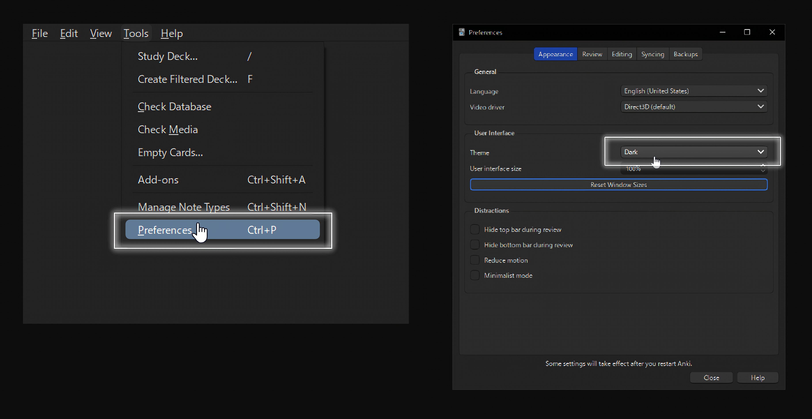
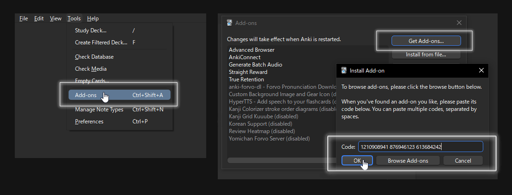
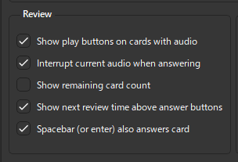

## What is Anki

Anki is a digital flashcard program which helps you learn and retain new information in a really effictive way. Because of this anki is not only used for language learning but can also be used for your studies, where you need to memorise a lot of information. Be it for an exam or just information you would like to aquire.

## What makes Anki so good

- Uses SRS ([Spaced Repition](https://en.wikipedia.org/wiki/Spaced_repetition)), a system where information you are having trouble with remembering is shown more often and easier ones are shown less frequent in order to make use of the psychological [spacing effect](https://en.wikipedia.org/wiki/Spacing_effect).
**Meaning you will remember things in a more efficient manner.**
- High customizability, which gives you a lot of freedom in the way you learn information i.e learn languages like Korean.
- Big community with a lot of great resources on everything.

---

## Download Anki

Download Anki from their [website](https://apps.ankiweb.net/) and install it normally.

---

## Dark Mode

Changing to dark mode is completely optional but card templates looks better that way.

> `Tools` → `Preferences` → `Appearance` → `Theme (dropdown)`

---

## Anki Add-ons

The following add-ons are a must for Anki.

### Conflicting Add-ons

As far as I'm aware, there are no conflicting add-ons. If you find any, let me know!

### How to install Add-ons

[Find](https://ankiweb.net/shared/addons) an addon you want to download and copy and paste its addon code in your Anki: 

> `Tools` → `Add-ons` → `Get Add-ons`

Hit OK, wait till its installed and restart Anki as prompted.

You should get the following addons.

### [Anki-Connect](https://foosoft.net/projects/anki-connect/)

> Code: `2055492159`

Required for Yomichan and most other Anki-related automated tasks to work. I use the default config that comes with the add-on.

### [True Retention](https://ankiweb.net/shared/info/613684242)

> Code: `613684242`

### [Straight Reward](https://ankiweb.net/shared/info/957961234)

> Code: `957961234`

---

## Optional Add-ons

These are optional, but neat and useful add-ons that make your Anki look nice.

### [PassFail](https://ankiweb.net/shared/info/876946123)

> Code: `876946123`

This removes the Easy and Hard button which you don't need anyways and can be just avoided when clicking either Fail or Pass.

### [Review Heatmap](https://ankiweb.net/shared/info/1771074083)

> Code: `1771074083`

Visualizes past and future card review activity in a calendar graph.

### [Custom Background Images](https://ankiweb.net/shared/info/1210908941)

> Code: `1210908941`

Allows you to set custom background images in Anki and during you reviews.

---

### Basic Anki Settings

> `Tools` → `Preferences` → `Review` 

You are free to change the settings under __Review__ to your preferences, they don't matter much either way.

I would recommend these settings:  

7. Create a new deck. __Add->Deck->Add->Enter a name->OK->Select it->Choose__ and close the window.
8. Open the options of your deck by hovering over it and clicking on the cog.
9. Under __New Cards__ change your learning steps to ``19s 5m 1h 1300m``. The reason for the micro-steps is that they give you more repeated exposure when learning new information than the default ``1 5 60`` settings.

## Card Templates

Use vocab cards, also known as word context cards, instead of sentences cards. If you are curious as to why, read [this](https://animecards.site/ankicards/).

