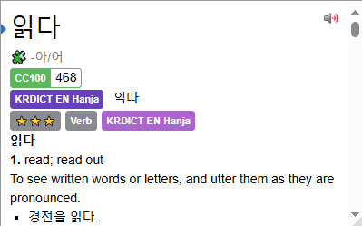
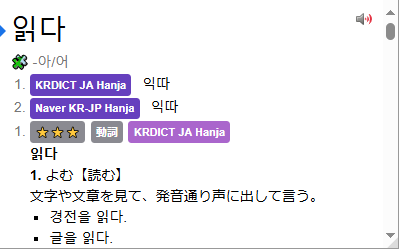
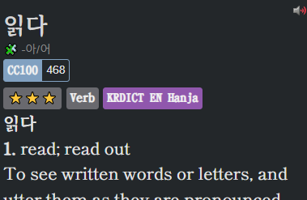
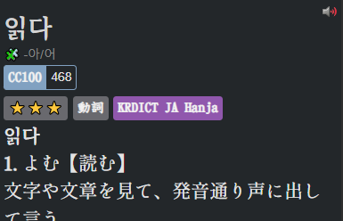
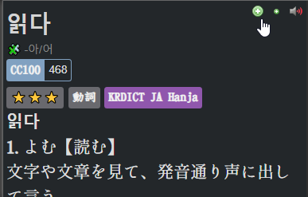

# How to set up Yomitan for Korean

## What is Yomitan?
Yomitan is a browser extension that allows you to look up Japanese words with both the meaning and the reading on web pages with ease.

## Getting Started 
Yomitan is available for both Chromium and Firefox based browsers. You can find the respective versions below.  
[Chrome Web Store](https://chromewebstore.google.com/detail/yomitan/likgccmbimhjbgkjambclfkhldnlhbnn)  
[Firefox](https://addons.mozilla.org/en-GB/firefox/addon/yomitan/)  
Once installed, it will open a new tab page, just close it for now so we don't confuse each other.

# Acquiring Dictionaries
When you first install Yomitan, you need to load dictionaries into it in order to use it.  
These files use the `.zip` extension and **are not to be extracted by the user.**

I recommend you install the following dictionaries. If you are comfortable enough in Japanese then always take the Japanese version as its more accurate then the English ones.

[KRDICT, Naver, STDICT](https://github.com/peldas/yomitan-dicts/releases/tag/yomitan-dicts-v1.1.1)  
[Frequency](https://github.com/Lyroxide/yomitan-ko-dic/releases/tag/1.0.0)

For people who know Japanese:  
- `KRDICT-JA-hanja.v1.3.3-with-pronunciation.zip`  
- `Naver-JA-hanja.v1.0.3-with-pronunciation.zip`  
- `kpedia.v1.0.0.zip`  
- `Frequency.CC100.Korean.zip`  

For people who don't know Japanese:  
- `KRDICT-EN-hanja.v1.0.3-with-pronunciation.zip`  
- `Frequency.CC100.Korean.zip`  

## Installing dictionaries and basic usage
  
1. Click on the  icon in the browser toolbar.  
2. Click on the  icon to access the settings page.  
3. On the left sidebar, click on "Dictionaries" and then click on "Configure installed and enabled dictionaries…"  
4. Click the "Import" button on the bottom.  
5. Here's where you select the dictionaries to import. Please only import the following.  
	- `KRDICT-JA-hanja.v1.3.3-with-pronunciation.zip`  
    - `Naver-JA-hanja.v1.0.3-with-pronunciation.zip`  
    - `kpedia.v1.0.0.zip`  
    - `Frequency.CC100.Korean.zip`  

6. Please wait for the dictionaries to import. This could take a while.
7. Once complete, you can test Yomitan by holding down the ++shift++ key and hovering over Korean text. Here is a sample: 한국어. It will display a pop up box displaying the definitions separated by dictionary.  

### English Version  
 
### Japanese Version  
 

Click anywhere outside of the box or press the ++esc++ key to dismiss.
Click on an individual kanji in the headword to view kanji information (only functional with KANJIDIC installed).

You can click the  button to hear the word being pronounced by a native speaker.

In your browser extensions toolbar, if you click on the Yomitan logo, then on the  icon or by using the ++alt+insert++ keyboard shortcut, you can access Yomitan Search, this is where you can use Yomitan as a standalone Japanese to English dictionary. 

Pop up box size can be edited with advanced settings enabled.  
A full dark mode can be enabled in the settings too.  

## Recommended Yomitan settings

0. Enable advance view in the bottem left corner.
1. Go to scanning and and check __Layout-aware scanning__ and __Deep content scanning__
2. Go to the appearance tab and set the body under theme to dark.

### Setting up audio

3. Go to the audio tab and check __Auto-play search result audio__
4. Click on __Configure audio playback sources…__ and add Custom URL (JSON) with the URL ``http://localhost:8770/?term={term}&reading={reading}&language=ko``

### Fonts
5. For Japanese you can use any Japanese font you like but I recommend [しっぽり明朝](fonts/shippori3.zip) and [ＤＦ教科書体W4](fonts/DFKyoKaSho-W4.ttf). For Korean I would get

### CSS settings

6. Go to the apperance tab and click on __Configure custom CSS...__ and paste in this [code](https://pastebin.com/CEtiKC8n).

Your end result should look something like this:
### English Version  
 
### Japanese Version  
 

# Anki in Yomitan

1. Get the [AnkiConnect](https://foosoft.net/projects/anki-connect/) addon for Anki.
2. Make sure its installed, then go into the Yomitan settings to the Anki tab and click on __Enable Anki integration__
3. Click on __Configure Anki card format…__ and select your mining deck and card type and close the window.
4. Now click on __Configure Anki card templates…__ and paste in your template.

Test if your mining setup works by clicking on the green add button in the popup window example.

